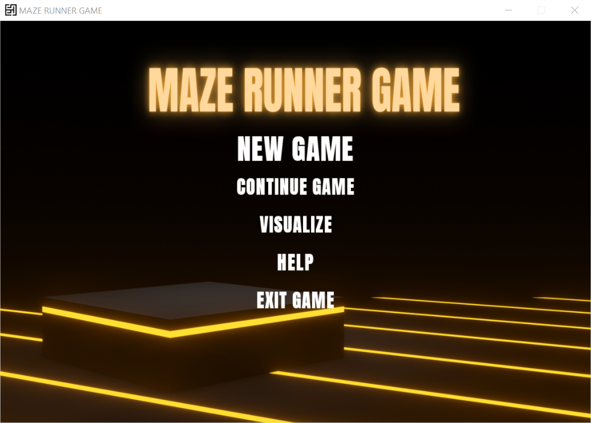
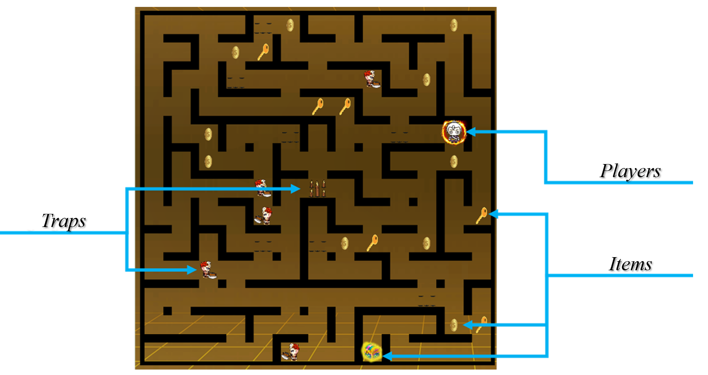
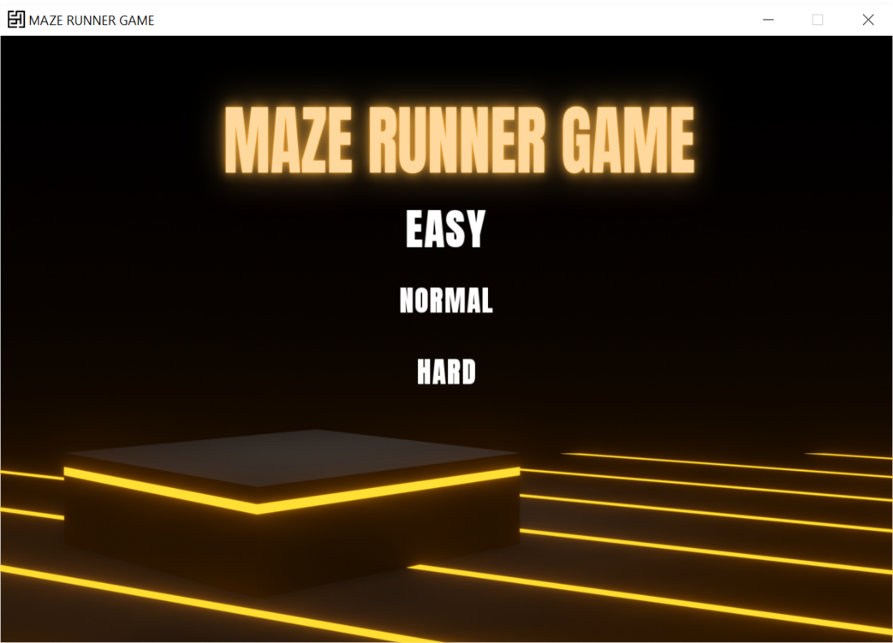
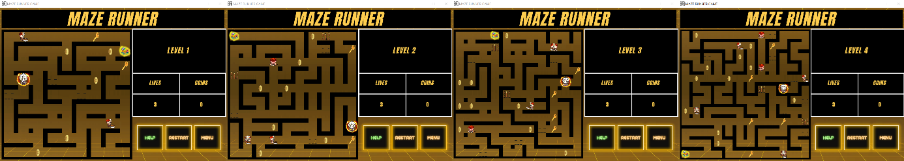
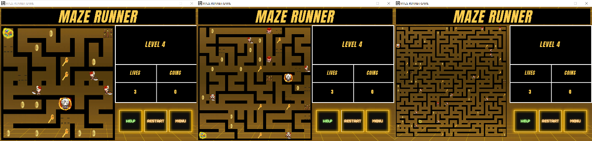
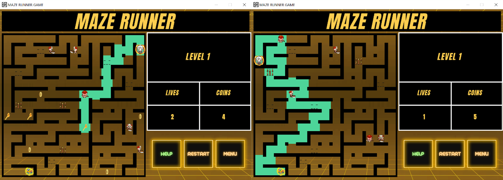
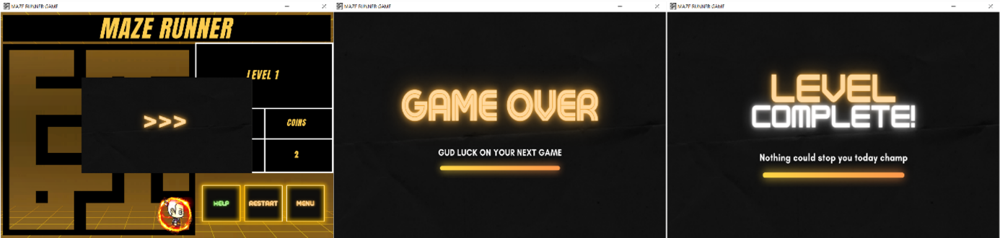
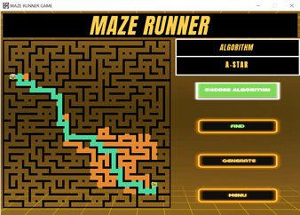

<!-- ABOUT THE PROJECT -->
## About The Project
Our project is based on a maze-solving game as well as supporting visualization for practicing.

<!-- Insert image here -->



<!-- GETTING STARTED -->
## Getting Started
To get a local copy up and running follow these simple example steps.

### Prerequisites
* C++ compiler
* Cmake

### Build
1. Create the build directory
   ```sh
   mkdir build
   cd build
   ```
2. Build
   ```sh
   cmake ..
   cmake --build . --config Release
   cd ..
   ```

<!-- USAGE EXAMPLES -->
## Usage

Now, the executed file is being in this folder _.\bin\Release_ 

Run _MazeRunnerGame.exe_ and enjoy the game.

## Game Play

Objects in game include: Traps, items and player.



Before entering, player can choose levels including: Easy, Normal and Hard. 



There are four rounds for each levels. Difficulty will be increased after each round in order to make game more challenging.



Moreover, difficulty also depends on levels as below:



Besides, player can use **Help** and pay 3 coins to ask _Bot_ the way to nearest key. 
If all keys are found, _Bot_ will guide player to the chest.



Other transition screens:



## Visualize 
**Visualize** is a feature where player can challenge _Bot_ to solve maze:
   + Choose algorithm from the set of {_BFS; DFS; A*_};
   + Use **Generate** to make a new random maze;
   + Drag and drop characters to change their positions;
   + Click **Find** to challenge _Bot_.

 

## Authors

- Pham Huu Phuc - 20120351 | [@phphuc62](https://github.com/phphuc62)
- Nguyen Quang Binh - 20120412 | [@nqbinh47](https://github.com/nqbinh47)
- Vu Van Thai - 20120579 | [@VuVanThai1410](https://github.com/VuVanThai1410)
